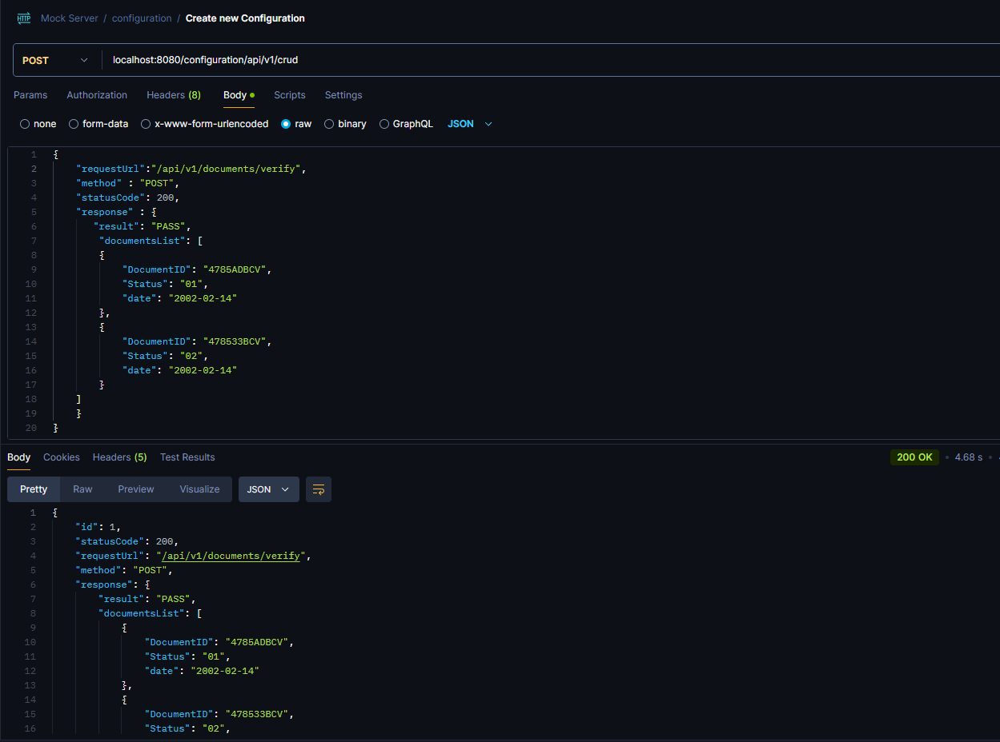
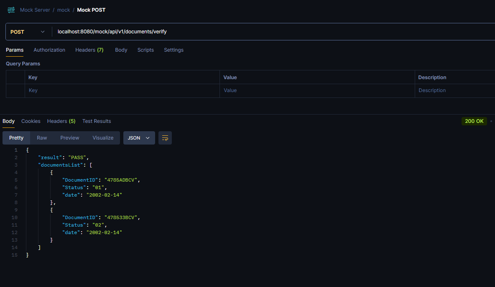
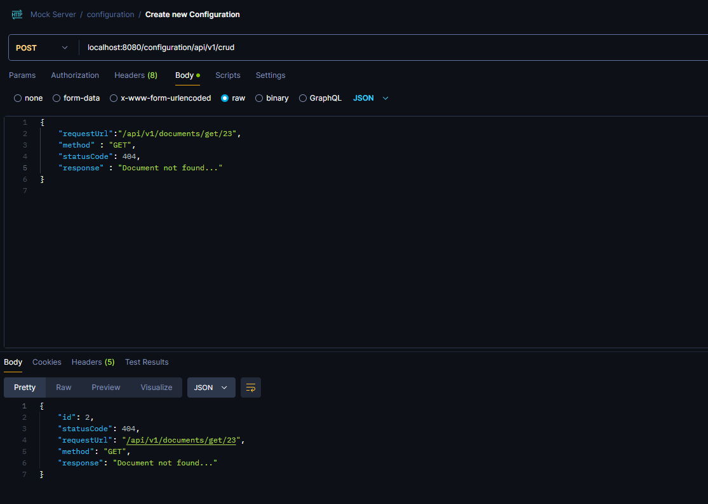
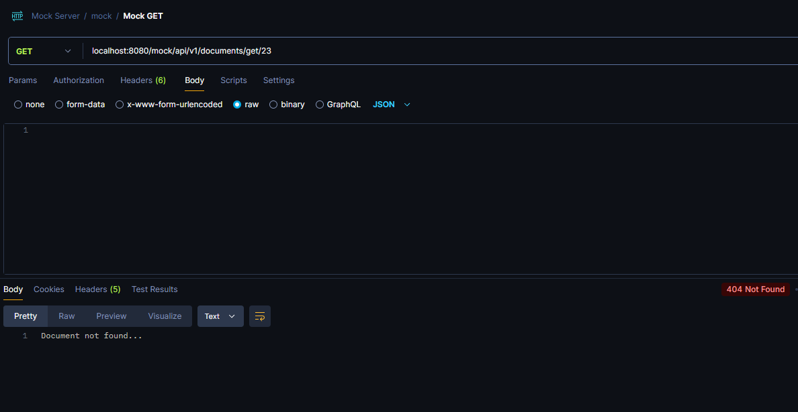
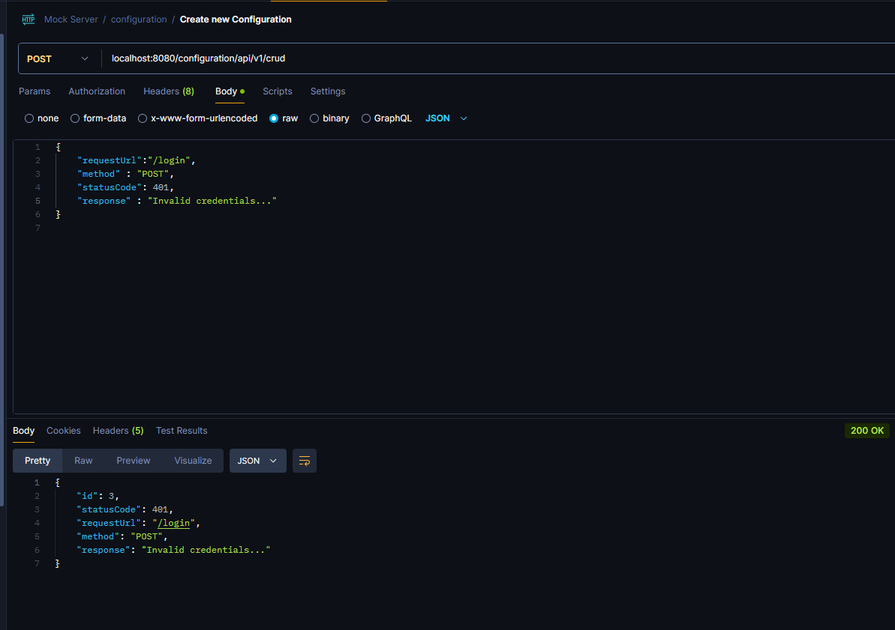
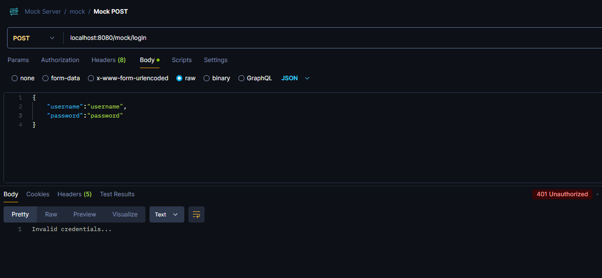

# Rest Mock Server

In this project, I’ve implemented a **Mock Server** using **Spring Boot 3** , Java 17 and H2 database, which generates mock responses for incoming REST requests. This server is useful for simulating API behavior during development, testing, and integration without needing a fully functional backend. The project uses Jakarta EE for validation and persistence, along with Spring Boot’s flexibility for handling HTTP requests.<br>
[Github repository](https://github.com/Source-Code-Wizard/RestMockServer/tree/develop)

## Features

- Simulate REST API responses for any endpoint.
- Support for HTTP methods: `GET`, `POST`, `PUT`, `DELETE`.
- Customizable HTTP status codes and response payloads.
- Dynamic matching of request URL paths and HTTP methods.
- CRUD operations for managing mock configurations.

## Project Structure

### DTO: `MockApiConfigDto`

This data transfer object (DTO) represents the mock API configuration. It includes the request path, method, status code, and response payload.

```java
@Builder
public record MockApiConfigDto(
    @JsonProperty(access = READ_ONLY) Long id,
    Integer statusCode,
    String requestUrl,
    @Pattern(regexp = "GET|POST|PUT|DELETE") String method,
    Object response
) {}

```

### Entity: `MockApiConfigurationEntity`

The entity maps the mock API configuration to a database table, storing the status code, request method, request path, and response.

```java
@Data
@Builder
@Entity
@Table(name = "MOCK_API_CONFIGURATION_ENTITY")
@AllArgsConstructor
@NoArgsConstructor
public class MockApiConfigurationEntity {
    @Id
    @GeneratedValue(strategy = GenerationType.IDENTITY)
    private long id;
    private Integer statusCode;
    private String method;
    private String requestPathUrl;
    private String response;
}

```

### Controller: `MockedResponseController`

The MockedResponseController handles all incoming HTTP requests under the /mock/** path. It delegates the request to the service layer, which fetches the appropriate response configuration:

```java
@RestController
@RequiredArgsConstructor
public class MockedResponseController {
    private final MockedResponseService mockedResponseService;

    @RequestMapping(path = "/mock/**")
    public ResponseEntity<Object> respondToRequest(HttpServletRequest httpServletRequest) throws IOException {
        final MockApiConfigDto mockedResponse = mockedResponseService.produceMockedResponse(httpServletRequest);
        return ResponseEntity.status(mockedResponse.statusCode()).body(mockedResponse.response());
    }
}

```

- **`/mock/**`**: Any request sent to this path is intercepted, and a mocked response is returned based on the configuration stored  in the database.
- **Dynamic URL Handling**: The controller accepts any path and delegates the responsibility to the service to find the appropriate response based on the URL and HTTP method.


### Service: `MockedResponseServiceImpl`

The MockedResponseServiceImpl is responsible for fetching the mock response configuration from the database and converting it into the appropriate response object:

```java
@Slf4j
@Service
@RequiredArgsConstructor
public class MockedResponseServiceImpl implements MockedResponseService {

  private final MockApiConfigRepository mockApiConfigRepository;
  private final ObjectMapper jsonMapper;

  @Override
  public MockApiConfigDto produceMockedResponse(HttpServletRequest httpServletRequest) throws IOException {
    final String requestURL = removeHostFromUrl(String.valueOf(httpServletRequest.getRequestURL()));
    final String requestMethod = httpServletRequest.getMethod();
    final MockApiConfigurationEntity mockApiConfigurationEntity = mockApiConfigRepository.findByRequestPathUrlAndMethod(requestURL.toString(), requestMethod)
      .orElseThrow(() -> new RuntimeException("Not found."));
    return MockApiConfigDto.builder()
      .response(jsonMapper.readValue(mockApiConfigurationEntity.getResponse(), Object.class))
      .statusCode(mockApiConfigurationEntity.getStatusCode())
      .build();
  }

  private String removeHostFromUrl(final String OriginalUrl) {
    return OriginalUrl.replace("http://localhost:8080/mock", "");
  }
}

```

- **Database Query:**: The service queries the repository for an entity that matches the request’s URL and HTTP method.
- **Response Generation**: It converts the stored response string into a Java object using Jackson's ObjectMapper.


## Additional Features: CRUD Operations

Apart from mocking API responses, the server also supports CRUD operations for managing mock configurations. This allows users to create, read, update, and delete mock configurations via REST API endpoints. This CRUD functionality enables easy manipulation of mock data for various use cases.

## How It Works

- **Request Matching:** When a request is made to /mock/{any-path}, the controller captures the request URL and HTTP method.
- **Configuration Lookup:** The service queries the database for a mock configuration that matches the request path and method.
- **Response Generation:** If a matching configuration is found, the service constructs a response based on the stored status code and response body.
- **Response Return:** The mocked response is returned to the client with the specified HTTP status and response body.

## Use Cases

- **Testing:** The mock server can be used to simulate API responses during integration tests, enabling developers to test API clients without needing an actual backend service.
- **Prototyping:** It allows frontend developers to prototype applications that depend on external APIs without waiting for those APIs to be developed.
- **Behavior Simulation:** Developers can simulate different API behaviors (e.g., different status codes or response formats) to test how their applications handle such scenarios.

## Examples:
* First scenario, we utilize the crud functionality of the mock-server to save a mocked configuration with a specific response , a specific status code ( 200 ) and a specific url (/api/v1/documents/verify).<br>
  <br>
  Now let's see how the server responds when we send a post request to the above url :<br>
   <br>
 We can see that the server responds with the response object and the status code of the request we send earlier.<br><br>

* Now let's try to save a GET request:<br>
 <br>
  Server's response after hitting the specified endpoint:<br>
 <br><br>

* Final example is an unsuccessful login scenario:<br>
  <br>
  Server responded with:<br>
  <br><br>

## Conclusion

This mock server provides a flexible and easy-to-use solution for simulating REST API responses. It is especially useful for developers who need to test API clients or prototype applications without relying on an actual backend.<br><br>

#### Thank you for your time and I hope that you found this post useful.<br>
[Github repository](https://github.com/Source-Code-Wizard/RestMockServer/tree/develop)


