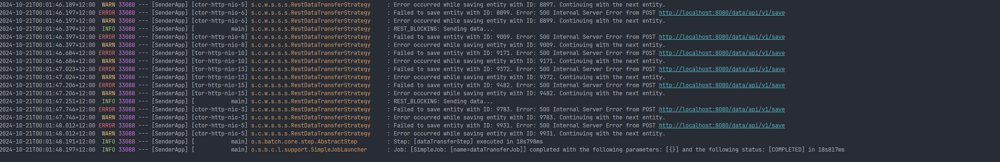
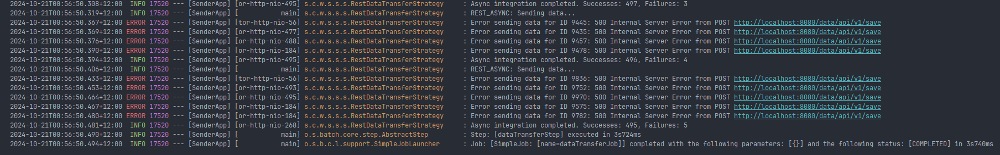
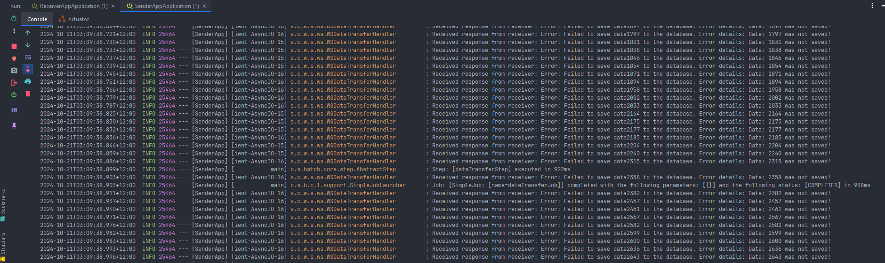
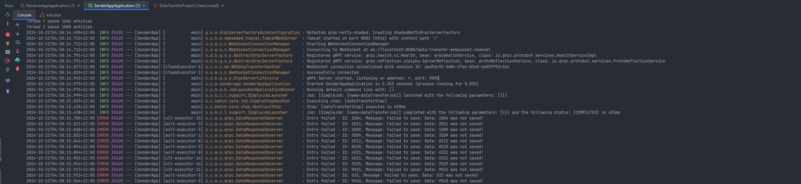

# Project Overview

We set out to tackle a common scenario in distributed systems: transferring large volumes of data between microservices.
Specifically, our goal was to efficiently move **10,000** entries in batches of **500** between two microservices, using
**Spring Boot 3** and **Java 17**.
This task served as a benchmark to evaluate the performance, scalability, and developer experience of each
protocol.<br><br>
**Important**: The primary objective of this article is to present and compare the timing results of data transmission
across three different protocols, rather than offering a detailed introduction to their underlying mechanisms. While
there will be explanations about the services involved, readers who are entirely new to these technologies may find the
content somewhat overwhelming and may need to consult other resources first.<br>
[Github repository](https://github.com/Source-Code-Wizard/Data-transfer-project/tree/develop)<br>

### Key features of our implementation include:

- Utilizing spring batch for data loading and processing.
- RESTful API endpoints with both synchronous and asynchronous implementations.
- gRPC streaming for efficient, bidirectional communication.
- WebSocket connections for real-time data transfer.
- Data transfer results for the three mentioned protocols.

## Efficient Data Retrieval Strategy

Our primary objective is to transfer 10,000 entries from the database of Microservice A to the database of Microservice
B. This task necessitates an efficient data retrieval strategy that minimizes database calls while avoiding excessive
memory consumption.

### Batch Processing Approach

To achieve optimal performance, we've implemented a batch processing approach. This method strikes a balance between
reducing the number of database queries and maintaining manageable memory usage within our application.

Key considerations:

1. **Avoiding Bulk Retrieval**: Executing a single `findAll()` query to fetch 10,000 entries simultaneously is
   suboptimal. Such an approach would lead to excessive memory allocation, potentially degrading application
   performance.

2. **Batch Size Optimization**: After careful consideration, we've determined that a batch size of 500 entries provides
   an ideal balance. This configuration results in a total of 20 database calls to retrieve the entire dataset,
   effectively distributing the memory load across multiple operations.

3. **Leveraging Spring Boot 3**: To implement this batch processing strategy, we've utilized the Spring Batch library, a
   powerful feature of Spring Boot 3. This library provides robust support for batch processing operations,
   significantly simplifying our implementation.

By adopting this approach, we ensure efficient data retrieval while maintaining optimal application performance
throughout the transfer process.

## Key Points of Spring Batch Configuration

```java
package source.code.wizard.senderapp.configuration;

import org.springframework.batch.core.Job;
import org.springframework.batch.core.Step;
import org.springframework.batch.core.job.builder.JobBuilder;
import org.springframework.batch.core.repository.JobRepository;
import org.springframework.batch.core.step.builder.StepBuilder;
import org.springframework.batch.item.ItemProcessor;
import org.springframework.batch.item.ItemWriter;
import org.springframework.batch.item.data.RepositoryItemReader;
import org.springframework.batch.item.data.builder.RepositoryItemReaderBuilder;
import org.springframework.beans.factory.annotation.Qualifier;
import org.springframework.context.annotation.Bean;
import org.springframework.context.annotation.Configuration;
import org.springframework.context.annotation.DependsOn;
import org.springframework.data.domain.Sort;
import org.springframework.transaction.PlatformTransactionManager;
import source.code.wizard.senderapp.batch.DataTransferItemWriter;
import source.code.wizard.senderapp.model.DataEntity;
import source.code.wizard.senderapp.service.DataTransferService;
import source.code.wizard.senderapp.repository.DataEntityRepository;

import java.util.Map;

@Configuration
@DependsOn("RandomDataGenerator")
public class SpringBatchConfiguration {

  private final DataEntityRepository dataEntityRepository;

  @Qualifier("RestDataTransferService")
  private final DataTransferService dataTransferService;

  private final JobRepository jobRepository;

  private static final int CHUNK_SIZE = 500;

  public SpringBatchConfiguration(@Qualifier("DataTransferService") DataTransferService dataTransferService,
                                  JobRepository jobRepository,
                                  DataEntityRepository dataEntityRepository) {
    this.dataTransferService = dataTransferService;
    this.jobRepository = jobRepository;
    this.dataEntityRepository = dataEntityRepository;
  }

  @Bean
  public Job dataTransferJob(Step dataTransferStep) {
    return new JobBuilder("dataTransferJob", jobRepository)
      .start(dataTransferStep)
      .build();
  }

  @Bean
  public Step dataTransferStep(JobRepository jobRepository,
                               PlatformTransactionManager platformTransactionManager,
                               RepositoryItemReader<DataEntity> reader,
                               ItemWriter<DataEntity> writer) {
    return new StepBuilder("dataTransferStep", jobRepository)
      .<DataEntity, DataEntity>chunk(500, platformTransactionManager)
      .reader(reader)
      .processor(processor())
      .writer(writer)
      .build();

  }

  @Bean
  public ItemWriter<DataEntity> writer() {
    return new DataTransferItemWriter(dataTransferService);
  }

  @Bean
  public ItemProcessor<DataEntity, DataEntity> processor() {
    // Simple pass-through processor
    return item -> item;
  }

  @Bean
  public RepositoryItemReader<DataEntity> reader() {
    return new RepositoryItemReaderBuilder<DataEntity>()
      .name("dataEntityReader")
      .repository(dataEntityRepository)
      .methodName("findAll")
      .arguments()
      .sorts(Map.of("id", Sort.Direction.ASC))
      .pageSize(CHUNK_SIZE)
      .build();
  }
}
```

### 1. Spring Batch Configuration Overview

This configuration sets up a Spring Batch job for transferring data using a repository-based item reader and a custom
item writer. It uses the newer `JobBuilder` and `StepBuilder` introduced in Spring Batch 5, which allows for better
configuration flexibility.

### 2. Annotations Used

- `@Configuration`: Marks the class as a Spring configuration class.
- `@DependsOn("RandomDataGenerator")`: Ensures that this configuration is loaded after the specified
  bean (`RandomDataGenerator`) has been initialized. This bean is responsible for creating and inserting 10.000 dummy
  entries in our database.

### 3. Bean Definitions

The configuration defines several beans required for the batch job setup:

- **Job (`dataTransferJob`)**: Defines a batch job named `dataTransferJob` that executes the specified
  step (`dataTransferStep`).
- **Step (`dataTransferStep`)**: Configures a step within the job using chunk-based processing, where the size of each
  chunk is set to 500 items.
- **RepositoryItemReader (`reader`)**: Reads data from the `DataEntityRepository` using pagination and sorting.
- **ItemProcessor (`processor`)**: Processes each item in the batch; in this case, it's a simple pass-through processor.
- **ItemWriter (`writer`)**: Uses a custom writer (`DataTransferItemWriter`) that sends data in batches using a
  REST-based service.

### 4. Writer Setup

- **Custom ItemWriter**: The`DataTransferItemWriter` class, implements the ItemWriter interface and delegates the task
  of sending the data to a DataTransferService service. This approach helps in decoupling data processing from data
  transmission.

```java
package source.code.wizard.senderapp.batch;

import lombok.extern.slf4j.Slf4j;
import org.springframework.batch.item.Chunk;
import org.springframework.batch.item.ItemWriter;
import org.springframework.beans.factory.annotation.Qualifier;
import source.code.wizard.senderapp.model.DataEntity;
import source.code.wizard.senderapp.service.DataTransferService;

import java.util.List;


@Slf4j
public class DataTransferItemWriter implements ItemWriter<DataEntity> {

  @Qualifier("DataTransferService")
  private final DataTransferService dataTransferService;

  public DataTransferItemWriter(@Qualifier("DataTransferService") DataTransferService dataTransferService) {
    this.dataTransferService = dataTransferService;
  }

  @Override
  public void write(Chunk<? extends DataEntity> chunk) {
    final List<? extends DataEntity> itemsToBeTransfered = chunk.getItems();
    dataTransferService.sendDataInBatches((List<DataEntity>) itemsToBeTransfered);
  }

}
```

### 5. Dependencies

```xml

<dependency>
  <groupId>org.springframework.batch</groupId>
  <artifactId>spring-batch-core</artifactId>
</dependency>
<dependency>
<groupId>org.springframework.batch</groupId>
<artifactId>spring-batch-infrastructure</artifactId>
</dependency>
```

## Rest approach

This approach contains:

- synchronous integration
- asynchronous integration

### 1. Synchronous integration

Fist, we start with a simple webclient configuration:

```java
package source.code.wizard.senderapp.configuration;

import org.springframework.context.annotation.Bean;
import org.springframework.context.annotation.Configuration;
import org.springframework.web.reactive.function.client.WebClient;


@Configuration
public class WebClientConfig {

  @Bean
  public WebClient webClient() {
    return WebClient.builder()
      .baseUrl("http://localhost:8080")
      .build();
  }
}
```

and then we have the actual method that is responsible for the data transmission between the services :

```java
package source.code.wizard.senderapp.service.strategy;

import lombok.RequiredArgsConstructor;
import lombok.extern.slf4j.Slf4j;
import org.springframework.beans.factory.annotation.Value;
import org.springframework.stereotype.Component;
import org.springframework.web.reactive.function.client.WebClient;
import reactor.core.publisher.Flux;
import reactor.core.publisher.Mono;
import reactor.core.scheduler.Schedulers;
import source.code.wizard.senderapp.model.DataEntity;

import java.time.Duration;
import java.util.List;
import java.util.concurrent.atomic.AtomicInteger;

@Slf4j
@Component
@RequiredArgsConstructor
public class RestDataTransferStrategy implements DataTransferStrategy {

  @Value("${app.rest.type}")
  private String integrationType;
  private static final String REST_BLOCKING = "REST_BLOCKING";
  private static final String REST_ASYNC = "REST_ASYNC";
  private final WebClient webClient;

  @Override
  public void sendDataInBatches(final List<DataEntity> data) {
    if (integrationType.equals(REST_ASYNC)) {
      log.info(REST_ASYNC + ": Sending data...");
    } else if (integrationType.equals(REST_BLOCKING)) {
      log.info(REST_BLOCKING + ": Sending data...");
      blockingRestIntegration(data);
    }
  }

  private void blockingRestIntegration(List<DataEntity> data) {
    data.forEach(dataEntity -> {
      webClient.post()
        .uri("/data/api/v1/save")
        .bodyValue(dataEntity)
        .retrieve()
        .bodyToMono(Void.class)
        .doOnError(error -> {
          log.error("Failed to save entity with ID: {}. Error: {}", dataEntity.getId(), error.getMessage());
        })
        .onErrorResume(error -> {
          // Log the error and continue with the next request
          log.warn("Error occurred while saving entity with ID: {}. Continuing with the next entity.", dataEntity.getId());
          return Mono.empty(); // Return an empty Mono to prevent blocking the entire process
        })
        .block();
    });
  }

  @Override
  public String getKey() {
    return "REST";
  }

}
```

This code defines a `RestDataTransferStrategy` class, which is a strategy for sending data using REST. It supports two
modes: asynchronous (`REST_ASYNC`) and blocking (`REST_BLOCKING`).
In blocking mode, it sends each `DataEntity` one by one to a specified REST endpoint using `WebClient`. It uses
the `.block()` method to wait for each request to complete before moving to the next,
logging any errors encountered during the process.
The strategy is configured by the `integrationType` value, which is provided through an application property.<br>

On the other side we have implemented a simple rest-controller that uses a service that saves the entity in the DB.To
make things more interesting and realistic in the service we throw an exeception with 1% percentage chance:

```java
package source.code.wizard.receiverapp.service;

import jakarta.transaction.Transactional;
import lombok.RequiredArgsConstructor;
import lombok.extern.slf4j.Slf4j;
import org.springframework.stereotype.Service;
import source.code.wizard.receiverapp.Model.dto.DataRequestDto;
import source.code.wizard.receiverapp.Model.entity.DataEntity;
import source.code.wizard.receiverapp.repository.DataEntityRepository;

import java.util.Random;

@Slf4
@Service
@RequiredArgsConstructor
public class DataEntityServiceImpl implements DataEntityService {

  private final DataEntityRepository dataEntityRepository;

  @Transactional
  @Override
  public void save(DataRequestDto dataRequestDto) throws Exception {
    log.info("Data with ID: " + dataRequestDto.id() + " received...");

    // Let's throw an exception in order for the sender to implement a simple error mechanism. 
    Random rand = new Random();
    if (rand.nextInt(100) == 1)
      throw new Exception("Data: " + dataRequestDto.id() + " was not saved!");

    dataEntityRepository.save(toEntity(dataRequestDto));
    log.info("Data with ID: " + dataRequestDto.id() + " was saved!");
  }

  private DataEntity toEntity(final DataRequestDto dataRequestDto) {
    return DataEntity.builder()
      .id(dataRequestDto.id())
      .fieldFour(dataRequestDto.fieldFour())
      .fieldThree(dataRequestDto.fieldThree())
      .fieldTwo(dataRequestDto.fieldTwo())
      .fieldOne(dataRequestDto.fieldOne())
      .build();
  }
}
```

Now let's see how the sender application behaves during data transmission:
 <br>

### Results:

The time duration recorded for each attempt is as follows:

- First try  : 18s817ms
- Second try : 19s386ms
- Third try  : 17s296ms
- **Average : 18.500 seconds**

### 2. Asynchronous integration

Now let's examine a more interesting and effecient apporach since we dodnt need to wait for the previous request to
finish in order to send the next one

```java
package source.code.wizard.senderapp.service.strategy;

import lombok.RequiredArgsConstructor;
import lombok.extern.slf4j.Slf4j;
import org.springframework.beans.factory.annotation.Value;
import org.springframework.stereotype.Component;
import org.springframework.web.reactive.function.client.WebClient;
import reactor.core.publisher.Flux;
import reactor.core.publisher.Mono;
import reactor.core.scheduler.Schedulers;
import source.code.wizard.senderapp.model.DataEntity;

import java.time.Duration;
import java.util.List;
import java.util.concurrent.atomic.AtomicInteger;

@Slf4j
@Component
@RequiredArgsConstructor
public class RestDataTransferStrategy implements DataTransferStrategy {

  @Value("${app.rest.type}")
  private String integrationType;
  private static final String REST_BLOCKING = "REST_BLOCKING";
  private static final String REST_ASYNC = "REST_ASYNC";
  private static final int BATCH_SIZE = 100;
  private static final int CONCURRENCY = 10;
  private static final Duration TIMEOUT = Duration.ofSeconds(30);
  private final WebClient webClient;

  @Override
  public void sendDataInBatches(final List<DataEntity> data) {
    if (integrationType.equals(REST_ASYNC)) {
      log.info(REST_ASYNC + ": Sending data...");
      asyncRestIntegration(data);
    } else if (integrationType.equals(REST_BLOCKING)) {
      log.info(REST_BLOCKING + ": Sending data...");
      blockingRestIntegration(data);
    }
  }

  private void blockingRestIntegration(List<DataEntity> data) {
    data.forEach(dataEntity -> {
      webClient.post()
        .uri("/data/api/v1/save")
        .bodyValue(dataEntity)
        .retrieve()
        .bodyToMono(Void.class)
        .doOnError(error -> {
          log.error("Failed to save entity with ID: {}. Error: {}", dataEntity.getId(), error.getMessage());
        })
        .onErrorResume(error -> {
          // Log the error and continue with the next request
          log.warn("Error occurred while saving entity with ID: {}. Continuing with the next entity.", dataEntity.getId());
          return Mono.empty(); // Return an empty Mono to prevent blocking the entire process
        })
        .block();
    });
  }

  private void asyncRestIntegration(List<DataEntity> data) {
    AtomicInteger successCount = new AtomicInteger(0);
    AtomicInteger failureCount = new AtomicInteger(0);

    Flux.fromIterable(data)
      .buffer(BATCH_SIZE)
      .flatMap(batch -> sendBatch(batch, successCount, failureCount), CONCURRENCY)
      .doOnComplete(() -> log.info("Async integration completed. Successes: {}, Failures: {}",
        successCount.get(), failureCount.get()))
      .blockLast(Duration.ofMinutes(1)); // This line of codes waits for all 500 requests to be finished
  }

  private Flux<Void> sendBatch(List<DataEntity> batch, AtomicInteger successCount, AtomicInteger failureCount) {
    return Flux.fromIterable(batch)
      .flatMap(data -> sendData(data, successCount, failureCount)
        .subscribeOn(Schedulers.boundedElastic()), CONCURRENCY)
      .onErrorContinue((error, obj) -> log.error("Error in batch: {}", error.getMessage()));
  }

  private Mono<Void> sendData(DataEntity data, AtomicInteger successCount, AtomicInteger failureCount) {
    return webClient.post()
      .uri("/data/api/v1/save")
      .bodyValue(data)
      .retrieve()
      .bodyToMono(Void.class)
      .timeout(TIMEOUT)
      .doOnSuccess(v -> successCount.incrementAndGet())
      .doOnError(e -> {
        failureCount.incrementAndGet();
        log.error("Error sending data for ID {}: {}", data.getId(), e.getMessage());
      })
      .onErrorResume(e -> Mono.empty());
  }

  @Override
  public String getKey() {
    return "REST";
  }
}
```

This code defines an asynchronous REST integration using WebFlux. It processes a list of DataEntity objects in batches,
sending them via HTTP POST requests using webClient. It tracks successes and failures with AtomicInteger counters. The
key parts are:

- asyncRestIntegration: Divides the list into batches, sending each batch concurrently, and waits for all batches to
  complete within a minute, in order for each Spring-batch step to be completed
- sendBatch: Sends each DataEntity in the batch concurrently, handling any errors that arise.
- sendData: Sends individual POST requests, logs successes and errors, and handles timeouts.
  The code uses the flatMap operator from Project Reactor to handle concurrency in the asynchronous processing of data
  batches. Let’s break down each flatMap usage in detail:

1. flatMap in asyncRestIntegration:

```java
    .flatMap(batch->sendBatch(batch,successCount,failureCount),CONCURRENCY)
```

- Purpose: This line processes each batch of data concurrently by calling the sendBatch method.
- Parameter CONCURRENCY: It limits the number of concurrent batch requests being processed at any given time. If
  CONCURRENCY is set to a value like 5, it ensures that only five batches are being sent simultaneously, improving
  throughput without overloading the system.
- Behavior: flatMap operates in a non-blocking manner, meaning that as soon as a batch completes, the next available
  batch can be processed, making it efficient for handling large amounts of data.

1. flatMap in sendBatch:

```java
     .flatMap(data->sendData(data,successCount,failureCount)
  .subscribeOn(Schedulers.boundedElastic()),CONCURRENCY)
  ```

- Purpose: This line processes each individual DataEntity within a batch concurrently by calling the sendData method.
- subscribeOn(Schedulers.boundedElastic()): The use of Schedulers.boundedElastic() ensures that each request is handled
  on a thread pool suitable for blocking I/O operations (like HTTP requests). This is useful when interacting with
  external services or when there is potential for blocking.
- Parameter CONCURRENCY: Similar to its use in the previous context, it limits the number of concurrent data requests
  being processed within a batch to prevent overwhelming the server or the external service.

Now let's see how the sender application behaves during data transmission:
 <br>

### Results:

The time duration recorded for each attempt is as follows:

- First try  : 3s740ms
- Second try : 3s200ms
- Third try  : 3s223ms
- **Average : 3.388 seconds.**

## Websockets approach

- In general :

WebSockets are a communication protocol that enables full-duplex, real-time communication between a client and a server
over a single, long-lived connection. Unlike traditional HTTP, which is request-response based, WebSockets allow for
continuous data exchange, making them ideal for applications that require low latency and real-time updates, such as
chat applications, online gaming, and live streaming. The protocol begins with an HTTP handshake, upgrading the
connection to WebSocket, which then facilitates two-way communication. WebSockets maintain a persistent connection,
allowing servers to push data to clients without requiring repeated requests. They are supported by most modern web
browsers and provide a lightweight alternative to other real-time communication methods like polling or long polling,
optimizing bandwidth usage and reducing latency.

### Sender application:

- Websockets configuration:

```java
package source.code.wizard.senderapp.configuration;

import lombok.RequiredArgsConstructor;
import org.springframework.context.annotation.Bean;
import org.springframework.context.annotation.Configuration;
import org.springframework.web.socket.client.WebSocketConnectionManager;
import org.springframework.web.socket.client.standard.StandardWebSocketClient;
import source.code.wizard.senderapp.ws.WSDataTransferHandler;

@Configuration
@RequiredArgsConstructor
public class WebSocketConfig {

  private final WSDataTransferHandler wsDataTransferHandler;

  @Bean
  public WebSocketConnectionManager webSocketConnectionManager() {
    StandardWebSocketClient client = new StandardWebSocketClient();
    WebSocketConnectionManager manager = new WebSocketConnectionManager(client, wsDataTransferHandler, "ws://localhost:8080/data-transfer-websocket-channel");
    manager.setAutoStartup(true); // Automatically start the connection on application startup
    return manager;
  }
}
```

**Bean Definition:**

- The method **webSocketConnectionManager()** is annotated with @Bean, indicating that it creates and returns a bean
  that will be managed by the Spring container.
  Inside this method:
- A **StandardWebSocketClient** is created, which is a WebSocket client that follows the standard WebSocket protocol.
- A **WebSocketConnectionManager** is instantiated with the StandardWebSocketClient, the WSDataTransferHandler for
  handling WebSocket messages, and the WebSocket server URL (ws://localhost:8080/data-transfer-websocket-channel).
- **manager.setAutoStartup(true)**: This line ensures that the WebSocket connection automatically starts when the
  application starts up.<br>

**Purpose:**<br>

The **WebSocketConnectionManager** handles the lifecycle of the WebSocket connection, including connecting,
reconnecting, and disconnecting.
The setup ensures that the application automatically connects to the WebSocket server specified in the URL as soon as
it starts, using the handler to process incoming and outgoing WebSocket messages.

- WSDataTransferHandler :

```java
package source.code.wizard.senderapp.ws;

import lombok.Getter;
import lombok.extern.slf4j.Slf4j;
import org.springframework.stereotype.Component;
import org.springframework.web.socket.CloseStatus;
import org.springframework.web.socket.TextMessage;
import org.springframework.web.socket.WebSocketSession;
import org.springframework.web.socket.handler.TextWebSocketHandler;

@Getter
@Slf4j
@Component
public class WSDataTransferHandler extends TextWebSocketHandler {
  private WebSocketSession session;

  @Override
  public void afterConnectionEstablished(WebSocketSession session) {
    log.info("WebSocket connection established with session ID: {}", session.getId());
    this.session = session; // Save the session to use later for sending messages
  }

  @Override
  protected void handleTextMessage(WebSocketSession session, TextMessage message) {
    log.info("Received response from receiver: {}", message.getPayload());
    // Here we can receive a validation response dto that contains all the info about the result of the procedure and act accordingly
  }

  @Override
  public void handleTransportError(WebSocketSession session, Throwable exception) {
    log.error("Transport error in WebSocket session ID: {}", session.getId(), exception);
    this.session = null; // Reset the session on error
  }

  @Override
  public void afterConnectionClosed(WebSocketSession session, CloseStatus status) {
    log.info("WebSocket connection closed with session ID: {}, status: {}", session.getId(), status);
    this.session = null; // Reset the session on close
  }

}
```

- WSDataTransferStrategy :

```java
package source.code.wizard.senderapp.service.strategy;

import com.fasterxml.jackson.core.JsonProcessingException;
import com.fasterxml.jackson.databind.ObjectMapper;
import lombok.RequiredArgsConstructor;
import lombok.extern.slf4j.Slf4j;
import org.springframework.stereotype.Component;
import org.springframework.web.socket.TextMessage;
import org.springframework.web.socket.WebSocketSession;
import org.springframework.web.socket.handler.TextWebSocketHandler;
import source.code.wizard.senderapp.model.DataEntity;
import source.code.wizard.senderapp.service.strategy.DataTransferStrategy;
import source.code.wizard.senderapp.ws.WSDataTransferHandler;

import java.io.IOException;
import java.util.List;

@Slf4j
@Component
@RequiredArgsConstructor
public class WSDataTransferStrategy extends TextWebSocketHandler implements DataTransferStrategy {

  private final WSDataTransferHandler wsDataTransferHandler;
  private static final ObjectMapper objectMapper = new ObjectMapper();

  @Override
  public void sendDataInBatches(List<DataEntity> data) {
    final WebSocketSession session = wsDataTransferHandler.getSession();
    if ((session) != null && session.isOpen()) {
      data.forEach(dataEntity -> {
        try {
          String jsonPayload = objectMapper.writeValueAsString(dataEntity);
          session.sendMessage(new TextMessage(jsonPayload));
        } catch (JsonProcessingException e) {
          log.error("Failed to convert DataEntity to JSON for entity ID: {}", dataEntity.getId(), e);
        } catch (IOException e) {
          log.error("Failed to send message for entity ID: {}", dataEntity.getId(), e);
        }
      });
    } else {
      log.error("WebSocket session is not open!");
    }
  }

  @Override
  public String getKey() {
    return "WEBSOCKET";
  }
}
```

- Uses WSDataTransferHandler to manage the WebSocket session.
- Uses ObjectMapper to convert DataEntity objects to JSON format.
- In sendDataInBatches(List<DataEntity> data), it checks if the WebSocket session is open.
- Iterates through each DataEntity, converting it to JSON and sending it as a TextMessage.
- Logs errors if JSON conversion or message sending fails, or if the session is closed.

### Receiver application:

- WebSocketConfig :

```java
package source.code.wizard.receiverapp.websocket.config;

import org.springframework.context.annotation.Configuration;
import org.springframework.web.socket.config.annotation.EnableWebSocket;
import org.springframework.web.socket.config.annotation.WebSocketConfigurer;
import org.springframework.web.socket.config.annotation.WebSocketHandlerRegistry;
import org.springframework.web.socket.server.support.HttpSessionHandshakeInterceptor;
import source.code.wizard.receiverapp.websocket.handler.DataWebSocketHandler;

@Configuration
@EnableWebSocket
public class WebSocketConfig implements WebSocketConfigurer {

  private final DataWebSocketHandler dataWebSocketHandler;

  public WebSocketConfig(DataWebSocketHandler dataWebSocketHandler) {
    this.dataWebSocketHandler = dataWebSocketHandler;
  }

  @Override
  public void registerWebSocketHandlers(WebSocketHandlerRegistry registry) {
    registry.addHandler(dataWebSocketHandler, "/data-transfer-websocket-channel")
      .setAllowedOrigins("*")
      .addInterceptors(new HttpSessionHandshakeInterceptor());
  }
}
```

- `registry.addHandler(dataWebSocketHandler, "/data-transfer-websocket-channel")` registers the handler (
  dataWebSocketHandler) to handle WebSocket connections at the URL endpoint /data-transfer-websocket-channel.
  This means any WebSocket requests made to this specific endpoint will be processed by the dataWebSocketHandler.
- `.setAllowedOrigins("*")` allows WebSocket requests from any origin (cross-origin requests). The * wildcard means
  there's no restriction on which domains can connect, which can be useful for development but might need to be
  restricted in production for security reasons.
- The `HttpSessionHandshakeInterceptor` helps in passing HTTP session attributes into the WebSocket session, allowing
  you to maintain user session information during WebSocket communication.

- DataWebSocketHandler :

```java
package source.code.wizard.receiverapp.websocket.handler;

import jakarta.transaction.Transactional;
import lombok.RequiredArgsConstructor;
import org.slf4j.Logger;
import org.slf4j.LoggerFactory;
import org.springframework.stereotype.Component;
import org.springframework.web.socket.CloseStatus;
import org.springframework.web.socket.TextMessage;
import org.springframework.web.socket.WebSocketSession;
import org.springframework.web.socket.handler.TextWebSocketHandler;
import source.code.wizard.receiverapp.Model.dto.DataRequestDto;
import source.code.wizard.receiverapp.Model.entity.DataEntity;
import source.code.wizard.receiverapp.repository.DataEntityRepository;
import source.code.wizard.receiverapp.util.DataEntityBuilder;

import java.io.IOException;
import java.util.Random;

@Component
@RequiredArgsConstructor
public class DataWebSocketHandler extends TextWebSocketHandler {
  private static final Logger logger = LoggerFactory.getLogger(DataWebSocketHandler.class);
  private final DataEntityRepository dataEntityRepository;

  @Override
  public void afterConnectionEstablished(WebSocketSession session) {
    logger.info("WebSocket connection established with session ID: {}", session.getId());
    // dataTransferService.setSession(session); // Set the session in the service
  }

  @Override
  @Transactional
  public void handleTextMessage(WebSocketSession session, TextMessage message) {
    logger.info("Received message from client: {}", message.getPayload());
    Long messageId = 0L;
    try {
      final DataRequestDto dataRequestDto = DataEntityBuilder.buildFromArray(message.asBytes());
      messageId = dataRequestDto.id();

      Random rand = new Random();
      if (rand.nextInt(100) = 1)
        throw new Exception("Data: " + messageId + " was not saved!");

      dataEntityRepository.save(toDataEntity(dataRequestDto));

      // Send success acknowledgment back to the sender
      // session.sendMessage(new TextMessage("Data successfully saved for ID: " + dataRequestDto.id()));
    } catch (IOException e) {
      logger.error("Failed to convert message to DataEntity object", e);
      // Notify the sender about the error
      sendMessageThroughWS(session, "Error: Failed to convert message to DataEntity object. Error details: " + e.getMessage());
    } catch (Exception e) {
      logger.error("Failed to save data to the database", e);
      // Notify the sender about the error
      sendMessageThroughWS(session, "Error: Failed to save data" + messageId + " to the database. Error details: " + e.getMessage());
    }
  }

  private static DataEntity toDataEntity(final DataRequestDto dataRequest) {
    return DataEntity.builder()
      .id(dataRequest.id())
      .fieldOne(dataRequest.fieldOne())
      .fieldTwo(dataRequest.fieldTwo())
      .fieldThree(dataRequest.fieldThree())
      .fieldFour(dataRequest.fieldFour())
      .build();
  }

  private static void sendMessageThroughWS(final WebSocketSession session, final String e) {
    try {
      session.sendMessage(new TextMessage(e));
    } catch (Exception sendError) {
      logger.error("Failed to send error message to sender", sendError);
    }
  }

  @Override
  public void handleTransportError(WebSocketSession session, Throwable exception) {
    logger.error("Transport error in WebSocket session ID: {}", session.getId(), exception);
  }

  @Override
  public void afterConnectionClosed(WebSocketSession session, CloseStatus status) {
    logger.info("WebSocket connection closed with session ID: {}, status: {}", session.getId(), status);
  }

}
```

The implementation is pretty similar with the implementation in the sender-app. Our main focus is `handleTextMessage`
method
that receives a `TextMessage` and deserializes it into the appropriate entity and save it in the DB **99%** of the
time.Otherwise
it sends a message back to the sender app to inform that something went wrong for the specific entity.<br>

Now let’s see how the sender application behaves during data transmission:
 <br>
The data transmission from the sender app to the receiver app completed in just 938ms.
However, we observed that the sender app continues to receive messages about problematic entries even after this
transmission time.
This behavior occurs because the sender app does not wait for a response from the receiver before sending the next
message.
This approach is highly efficient as it allows for a large volume of data to be transmitted in a short amount of time,
while still keeping us informed of any errors from the receiver side, enabling us to respond and address issues
promptly.<br>

### Results:

The time duration recorded for each attempt is as follows:

- First try  : 938ms
- Second try : 912ms
- Third try  : 922ms
- **Average : 924 ms.**

## gRPC approach

- In general :
  gRPC (gRPC Remote Procedure Call) is an open-source framework developed by Google that enables efficient communication
  between client
  and server applications. It uses Protocol Buffers (protobufs) as its interface definition language, allowing for
  strong typing and automatic generation of client and server code in multiple programming languages. gRPC supports
  various communication patterns, including unary (single request/response), server streaming, client streaming, and
  bidirectional streaming. It operates over HTTP/2, enabling multiplexing of requests and improved performance. gRPC
  also provides built-in features like authentication, load balancing, and support for deadlines and cancellation. Its
  focus on performance and scalability makes it ideal for microservices architecture and inter-service communication.

### Sender application:

- .proto file :

```proto
syntax = "proto3";

option java_multiple_files = true;
option java_package = "source.code.wizard.grpc";
option java_outer_classname = "DataTransferProto";
import "google/protobuf/empty.proto"; // Import the empty message

package data;

service GRPCDataTransferService {
  rpc SendData (stream DataRequest) returns (stream DataResponse) {} // Added google.protobuf.Empty to avoid empty returns
}

// The request message containing the user's ID.
message DataRequest {
  // each field in every DTO/class must be assigned an index starting from 1
  int64 id = 1; 
  string fieldOne = 2;
  string fieldTwo = 3;
  string fieldThree = 4;
  string fieldFour = 5;
  string fieldFive = 6;
}

message DataResponse {
  int64 id = 1; // Changed to int64 and added field number
  string message = 2;
}

```

This is a Protocol Buffers (protobuf) definition file for a gRPC service named `GRPCDataTransferService`. The `syntax`
specifies that this file uses proto3 syntax, which is the latest version of Protocol Buffers.

- **Options**:
  - `java_multiple_files = true` indicates that each generated message will be in its own Java file.
  - `java_package` and `java_outer_classname` define the package structure and the outer class name for the generated
    Java code.

- **Imports**: It imports `google/protobuf/empty.proto`, which allows the use of an empty message type.

- **Package**: The protobuf file defines a package named `data`.

- **Service Definition**:
  - `GRPCDataTransferService` includes a single RPC method, `SendData`, which takes a stream of `DataRequest` messages
    and returns a stream of `DataResponse` messages. This means clients can send multiple requests and receive multiple
    responses in a single call.

- **Message Definitions**:
  - `DataRequest` contains fields to capture user data, including an ID (`int64 id`) and five string fields.
  - `DataResponse` includes an ID and a message to provide feedback or acknowledgment related to the sent data.

This setup facilitates efficient streaming data transfer in a gRPC context, leveraging the benefits of Protocol Buffers
for serialization. <br>

- DataResponseObserver :

```java
package source.code.wizard.senderapp.grpc;

import io.grpc.ManagedChannel;
import io.grpc.stub.StreamObserver;
import lombok.extern.slf4j.Slf4j;
import source.code.wizard.grpc.DataResponse;

import java.util.concurrent.CountDownLatch;
import java.util.concurrent.atomic.AtomicLong;

@Slf4j
public class DataResponseObserver implements StreamObserver<DataResponse> {
  private final CountDownLatch latch = new CountDownLatch(1);
  private final AtomicLong successCount = new AtomicLong(0);
  private final AtomicLong failureCount = new AtomicLong(0);

  private final ManagedChannel communicationChannel;

  public DataResponseObserver(ManagedChannel communicationChannel) {
    this.communicationChannel = communicationChannel;
  }

  @Override
  public void onNext(DataResponse dataResponse) {
    if (dataResponse.getId() == -1) {
      // This is the summary response
      log.info("Transfer summary: {}", dataResponse.getMessage());
    } else {
      if (dataResponse.getMessage().startsWith("Failed")) {
        failureCount.incrementAndGet();
        log.error("Entry failed - ID: {}, Message: {}", dataResponse.getId(), dataResponse.getMessage());
      } else {
        successCount.incrementAndGet();
        // log.info("Entry succeeded - ID: {}, Message: {}", dataResponse.getId(), dataResponse.getMessage());
      }
    }
  }

  @Override
  public void onError(Throwable throwable) {
    log.error("Error occurred during data transfer: " + throwable.getMessage());
    latch.countDown();
  }

  @Override
  public void onCompleted() {
    log.info("Data transfer completed. Successful: {}, Failed: {}", successCount.get(), failureCount.get());
    communicationChannel.shutdown();
    latch.countDown();
  }
}
```

The `DataResponseObserver` class implements the `StreamObserver<DataResponse>` interface from gRPC, allowing it to
handle incoming responses from a gRPC service that sends `DataResponse` messages. Here's a breakdown of its
functionality:

### Class Structure

- **Annotations**:
  - `@Slf4j`: Enables logging capabilities using Lombok.

- **Fields**:
  - `CountDownLatch latch`: Used to block the current thread until all responses are received, allowing for
    synchronization.
  - `AtomicLong successCount`: A thread-safe counter to track the number of successful data transfers.
  - `AtomicLong failureCount`: A thread-safe counter to track the number of failed data transfers.
  - `ManagedChannel communicationChannel`: A gRPC channel.

### Methods

1. **`onNext(DataResponse dataResponse)`**:

- This method is called whenever a new `DataResponse` message is received from the gRPC service.
- It checks the ID of the response:
  - If the ID is `-1`, it treats this as a summary response and logs the transfer summary message.
  - If the message starts with "Failed", it increments the failure count and logs the failure details.
  - Otherwise, it increments the success count.

2. **`onError(Throwable throwable)`**:

- This method is invoked when an error occurs during the data transfer process.
- It logs the error message and calls `latch.countDown()` to signal that the data transfer has ended, regardless of
  success or failure.

3. **`onCompleted(final ManagedChannel communicationChannel)`**:

- This method is called when the data transfer is completed.
- It logs the total number of successful and failed transfers and calls `latch.countDown()` to indicate that the
  response stream is finished.
- it closes the communication channel when there are no more responses to receive.

### Purpose

The `DataResponseObserver` serves as a handler for gRPC streaming responses, managing success and failure counts,
logging relevant messages, and providing a mechanism to wait for the completion of the data transfer process. It is
designed to be used in contexts where a client sends multiple requests and needs to process the responses asynchronously
while keeping track of the overall success and failure rates.

- GRPCDataTransferStrategy :

```java
package source.code.wizard.senderapp.service.strategy;

import io.grpc.ManagedChannel;
import io.grpc.ManagedChannelBuilder;
import io.grpc.stub.StreamObserver;
import lombok.extern.slf4j.Slf4j;
import org.springframework.stereotype.Component;
import source.code.wizard.grpc.DataRequest;
import source.code.wizard.grpc.GRPCDataTransferServiceGrpc;
import source.code.wizard.senderapp.grpc.DataResponseObserver;
import source.code.wizard.senderapp.model.DataEntity;

import java.util.List;

@Slf4j
@Component
public class GRPCDataTransferStrategy implements DataTransferStrategy {

  @Override
  public void sendDataInBatches(List<DataEntity> data) {
    final ManagedChannel communicationChannel = ManagedChannelBuilder.forAddress("localhost", 8090)
      .usePlaintext()
      .build();
    final GRPCDataTransferServiceGrpc.GRPCDataTransferServiceStub grpcDataTransferServiceStub = GRPCDataTransferServiceGrpc.newStub(communicationChannel);
    final DataResponseObserver dataResponseObserver = new DataResponseObserver(communicationChannel);

    StreamObserver<DataRequest> dataRequestStreamObserver = grpcDataTransferServiceStub.sendData(dataResponseObserver);

    data.forEach(dataEntity -> {
      DataRequest request = toDataRequest(dataEntity);
      dataRequestStreamObserver.onNext(request);
    });

    dataRequestStreamObserver.onCompleted();
  }

  private DataRequest toDataRequest(final DataEntity dataEntity) {
    return DataRequest.newBuilder()
      .setFieldOne(dataEntity.getFieldOne())
      .setFieldTwo(dataEntity.getFieldTwo())
      .setFieldThree(dataEntity.getFieldThree())
      .setFieldFour(dataEntity.getFieldFour())
      .setId(dataEntity.getId())
      .build();
  }

  @Override
  public String getKey() {
    return "gRPC";
  }
}

```

The `GRPCDataTransferStrategy` class implements the `DataTransferStrategy` interface and is responsible for sending data
in batches using gRPC. Below is a concise breakdown of its structure and functionality:

### Class Structure

- **Annotations**:
  - `@Slf4j`: Enables logging capabilities using Lombok.
  - `@Component`: Indicates that this class is a Spring-managed component.

### Fields

- `boolean flag`: A flag that determines whether to wait for completion before shutting down the gRPC channel.

### Methods

1. **`sendDataInBatches(List<DataEntity> data)`**:

- Establishes a gRPC channel to the receiver service running at `localhost` on port `8090`.
- Creates a non-blocking gRPC stub (`grpcDataTransferServiceStub`) for invoking remote methods on the receiver service.
- Initializes a `DataResponseObserver` to handle responses from the server.
- Sends each `DataEntity` from the list as a `DataRequest` through the `dataRequestStreamObserver`.
- Calls `onCompleted()` on the stream observer to signal that all requests have been sent.
- If the flag is set, it waits for completion of the data transfer and gracefully shuts down the channel.
- Logs the count of successful and failed entries after data transfer is completed.

2. **`toDataRequest(DataEntity dataEntity)`**:

- Converts a `DataEntity` instance into a `DataRequest` object, setting the relevant fields.
- Utilizes the builder pattern to construct the `DataRequest`.

3. **`getKey()`**:

- Returns a string identifier `"gRPC"` representing the data transfer strategy.

### Purpose

The `GRPCDataTransferStrategy` class facilitates batch data transmission from a sender application to a receiver service
using gRPC. It establishes the connection, sends data asynchronously, and logs the success and failure rates, allowing
for efficient and manageable data transfer operations.

### Receiver application:

- DataReceiverService :

```java
package source.code.wizard.receiverapp.grpc;

import io.grpc.stub.StreamObserver;
import lombok.RequiredArgsConstructor;
import net.devh.boot.grpc.server.service.GrpcService;
import org.springframework.stereotype.Service;
import source.code.wizard.grpc.DataRequest;
import source.code.wizard.grpc.DataResponse;
import source.code.wizard.grpc.GRPCDataTransferServiceGrpc;
import source.code.wizard.receiverapp.repository.DataEntityRepository;

@Service
@GrpcService
@RequiredArgsConstructor
public class DataReceiverService extends GRPCDataTransferServiceGrpc.GRPCDataTransferServiceImplBase {

  private final DataEntityRepository repository;

  @Override
  public StreamObserver<DataRequest> sendData(StreamObserver<DataResponse> responseObserver) {
    return new DataReceiverObserver(repository, responseObserver);
  }
}
```

The `DataReceiverService` class is a gRPC service implementation that handles incoming streaming data requests in a
gRPC-based data transfer setup. Here's a breakdown of its key components:

1. **Class Annotations**:

- `@GrpcService`: Registers this class as a gRPC service, enabling it to handle incoming gRPC requests.

2. **Class Definition**:

- The class extends `GRPCDataTransferServiceGrpc.GRPCDataTransferServiceImplBase`, which is a generated base class for
  the gRPC service. This makes `DataReceiverService` an implementation of the defined gRPC service, allowing it to
  handle incoming RPC calls.

3. **`sendData` Method**:

- The `sendData` method is an overridden method that handles a streaming RPC call from the client.
- It takes a `StreamObserver<DataResponse>` as a parameter, which is used to send responses back to the client.
- The method returns a `StreamObserver<DataRequest>`, allowing the service to receive a stream of `DataRequest` messages
  from the client.

4. **Creating the `DataReceiverObserver`**:

- The `DataReceiverObserver` instance is created with the `repository` and the `responseObserver`. This observer handles
  the incoming data requests and processes them accordingly.
- This approach allows for efficient handling of data streams by processing requests as they are received and sending
  responses back to the client.

The `DataReceiverService` class serves as the gRPC endpoint for handling data transfer requests in a streaming manner.
It processes incoming `DataRequest` messages and sends back `DataResponse` messages, utilizing
the `DataReceiverObserver` to manage the data flow efficiently.

- DataReceiverObserver :

```java
package source.code.wizard.receiverapp.grpc;

import io.grpc.stub.StreamObserver;
import jakarta.transaction.Transactional;
import lombok.extern.slf4j.Slf4j;
import source.code.wizard.grpc.DataRequest;
import source.code.wizard.grpc.DataResponse;
import source.code.wizard.receiverapp.Model.entity.DataEntity;
import source.code.wizard.receiverapp.repository.DataEntityRepository;

import java.util.Random;
import java.util.concurrent.atomic.AtomicLong;

@Slf4j
public class DataReceiverObserver implements StreamObserver<DataRequest> {

  private final DataEntityRepository dataEntityRepository;
  private final StreamObserver<DataResponse> responseObserver;
  private final AtomicLong successCount = new AtomicLong(0);
  private final AtomicLong failureCount = new AtomicLong(0);

  public DataReceiverObserver(DataEntityRepository dataEntityRepository, StreamObserver<DataResponse> responseObserver) {
    this.dataEntityRepository = dataEntityRepository;
    this.responseObserver = responseObserver;
  }

  @Override
  @Transactional
  public void onNext(DataRequest dataRequest) {
    try {
      log.info("Data with ID: {} was received!", dataRequest.getId());
      final DataEntity dataEntity = DataEntity.builder()
        .fieldOne(dataRequest.getFieldOne())
        .fieldTwo(dataRequest.getFieldTwo())
        .fieldThree(dataRequest.getFieldThree())
        .fieldFour(dataRequest.getFieldFour())
        .id(dataRequest.getId())
        .build();

      // Simulating a scenario when something goes wrong
      Random rand = new Random();
      if (rand.nextInt(100) == 1) {
        throw new Exception("Data: " + dataEntity.getId() + " was not saved!");
      }

      dataEntityRepository.save(dataEntity);
      log.info("Data with ID: {} was saved!", dataEntity.getId());
      successCount.incrementAndGet();

      // Send a success response for this entry
      sendResponse(dataRequest.getId(), "Data saved successfully");

    } catch (Exception e) {
      log.error("Failed to save data with ID: {}", dataRequest.getId(), e);
      failureCount.incrementAndGet();

      // Send an error response for this entry
      sendResponse(dataRequest.getId(), "Failed to save: " + e.getMessage());
    }
  }

  private void sendResponse(long id, String message) {
    DataResponse response = DataResponse.newBuilder()
      .setId(id)
      .setMessage(message)
      .build();
    responseObserver.onNext(response);
  }

  @Override
  public void onError(Throwable throwable) {
    log.error("Error in stream", throwable);
    // You might want to send a final error response here
  }

  @Override
  public void onCompleted() {
    log.info("Stream completed. Successful saves: {}, Failed saves: {}",
      successCount.get(), failureCount.get());

    // Send a final summary response
    DataResponse summaryResponse = DataResponse.newBuilder()
      .setId(-1) // Use a special ID to indicate summary
      .setMessage(String.format("Transfer completed. Successful: %d, Failed: %d",
        successCount.get(), failureCount.get()))
      .build();
    responseObserver.onNext(summaryResponse);
    responseObserver.onCompleted();
  }
}

```

The `DataReceiverObserver` class implements the `StreamObserver<DataRequest>` interface to handle streaming data
requests in a gRPC service. It processes each incoming `DataRequest` message and sends back responses using
the `responseObserver`. Here's a concise overview of its components:

1. **Fields**:

- `dataEntityRepository`: Repository used for saving data entities to the database.
- `responseObserver`: Used to send `DataResponse` messages back to the gRPC client.
- `successCount` and `failureCount`: `AtomicLong` counters that track the number of successful and failed saves.

2. **Constructor**:

- Initializes the `DataEntityRepository` and `StreamObserver<DataResponse>` fields, enabling interaction with the
  database and the response stream.

3. **`onNext` Method**:

- Processes each `DataRequest` as it arrives, converting it into a `DataEntity` object.
- Simulates a failure scenario with a random chance for error to test error handling.
- If the data is successfully saved, it increments the `successCount` and sends a success response to the client.
- If an error occurs, it logs the error, increments the `failureCount`, and sends an error response.

4. **`sendResponse` Method**:

- Constructs and sends a `DataResponse` message to the client with the status of the processed entry (success or
  failure).

5. **`onError` Method**:

- Handles any errors that occur during the streaming process, logging the error details.

6. **`onCompleted` Method**:

- Called when the data stream is complete, logging the total count of successful and failed saves.
- Sends a final summary response to the client, indicating the number of successful and failed entries.
- Completes the response stream to signal the end of communication.

The `DataReceiverObserver` class efficiently handles data streaming in a gRPC service by processing
incoming `DataRequest` messages, saving them to the database, and sending `DataResponse` messages to the client with the
results. It ensures robust error handling and provides a summary at the end of the data transfer session.

- Depedencies :

```xml

<dependencies>
  <!-- gRPC Spring Boot starter -->
  <dependency>
    <groupId>net.devh</groupId>
    <artifactId>grpc-spring-boot-starter</artifactId>
    <version>2.15.0.RELEASE</version>
  </dependency>

  <!-- Spring Boot gRPC Client -->
  <dependency>
    <groupId>net.devh</groupId>
    <artifactId>grpc-client-spring-boot-starter</artifactId>
    <version>3.0.0.RELEASE</version>
  </dependency>

  <!-- gRPC -->
  <dependency>
    <groupId>io.grpc</groupId>
    <artifactId>grpc-netty-shaded</artifactId>
    <version>${io.grpc.version}</version>
  </dependency>
  <dependency>
    <groupId>io.grpc</groupId>
    <artifactId>grpc-protobuf</artifactId>
    <version>${io.grpc.version}</version>
  </dependency>
  <dependency>
    <groupId>io.grpc</groupId>
    <artifactId>grpc-stub</artifactId>
    <version>${io.grpc.version}</version>
  </dependency>

  <!-- Protobuf -->
  <dependency>
    <groupId>com.google.protobuf</groupId>
    <artifactId>protobuf-java</artifactId>
    <version>3.25.1</version>
  </dependency>
  <dependency>
    <groupId>com.google.protobuf</groupId>
    <artifactId>protobuf-java-util</artifactId>
    <version>3.21.5</version>
  </dependency>

  <dependency>
    <groupId>javax.annotation</groupId>
    <artifactId>javax.annotation-api</artifactId>
    <version>1.3.2</version>
  </dependency>
</dependencies>
<extensions>
<extension>
  <groupId>kr.motd.maven</groupId>
  <artifactId>os-maven-plugin</artifactId>
  <version>${os-maven-plugin.version}</version>
</extension>
</extensions>
<plugins>
<plugin>
  <groupId>org.xolstice.maven.plugins</groupId>
  <artifactId>protobuf-maven-plugin</artifactId>
  <version>${protobuf-maven-plugin.version}</version>
  <configuration>
    <protocArtifact>com.google.protobuf:protoc:${protoc.version}:exe:${os.detected.classifier}
    </protocArtifact>
    <pluginId>grpc-java</pluginId>
    <pluginArtifact>io.grpc:protoc-gen-grpc-java:${io.grpc.version}:exe:${os.detected.classifier}
    </pluginArtifact>
  </configuration>
  <executions>
    <execution>
      <id>protobuf-compile</id>
      <goals>
        <goal>compile</goal>
        <goal>test-compile</goal>
      </goals>
    </execution>
    <execution>
      <id>protobuf-compile-custom</id>
      <goals>
        <goal>compile-custom</goal>
        <goal>test-compile-custom</goal>
      </goals>
    </execution>
  </executions>
</plugin>
</plugins>
```

Now let’s see how the sender application behaves during data transmission:
 <br>
Like in the websocket approach , the service does not wait for a response in order for it to send the next request.
Also, gRPC is fast because it is designed with performance in mind, leveraging several key factors:

1. **Efficient Protocol Buffers**: gRPC uses Protocol Buffers (protobuf) as its interface definition language and data
   serialization format, which is much more compact and faster to serialize/deserialize than formats like JSON or XML.

2. **HTTP/2**: It uses HTTP/2 as its transport protocol, which supports multiplexing (multiple requests and responses
   over a single connection), bidirectional streaming, header compression, and reduced latency, all contributing to
   faster communication.

3. **Binary Format**: The binary encoding of protobuf messages is smaller in size compared to text-based formats,
   leading to quicker data transmission and reduced network load.

4. **Streaming Support**: gRPC natively supports streaming (both client-side, server-side, and bidirectional), which
   enables efficient data transfer without needing to open and close connections repeatedly.

5. **Connection Management**: Since gRPC maintains persistent connections through HTTP/2, it reduces the overhead of
   establishing new connections, speeding up the communication process.

6. **Low Latency**: The combination of HTTP/2's low latency features and protobuf's efficient data handling
   significantly reduces the time it takes to process requests and responses.

These factors make gRPC an ideal choice for high-performance applications requiring fast and reliable communication
between services.

### Results:

The time duration recorded for each attempt is as follows:

- First try  : 425ms
- Second try : 395ms
- Third try  : 417ms
- **Average : 412ms.**


## Experiment on your own
If you're looking to clone this project and build upon its implementation, here are a few insights to help you get started: [Github repository](https://github.com/Source-Code-Wizard/Data-transfer-project/tree/develop)

- The project is a multi-module setup consisting of two submodules: **ReceiverApp** and **SenderApp**.
- Be sure to start both **ReceiverApp** and **SenderApp** before testing the functionality.
- The **SenderApp** employs a **Strategy Pattern** to determine which data transfer approach to use. To introduce a new data transfer method, simply create a new strategy class with the appropriate key.
- Both applications utilize in-memory databases.
- Data transfer is initiated automatically when **ReceiverApp** starts.


**Thank you for your time!**
